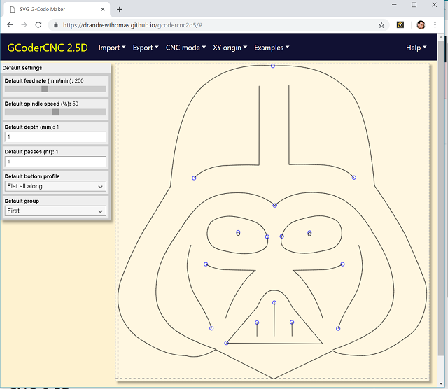

# GCoderCNC

GCoderCNC has been updaded to version 1.7: [see more details in the changelog](https://github.com/drandrewthomas/gcodercnc2d5/blob/master/changelog.md). Note that as of v1.7 GCoderCNC is no longer a progressive web app (PWA). So, if you have trouble accessing the latest version please uninstall the PWA and/or clear your browser cache.

## What is GCoderCNC

GCoderCNC is a completely free and open source web app for creating G-Code files from SVG graphics, such as the ones you can create using [Inkscape](https://inkscape.org/), [Boxy](https://boxy-svg.com/) or [Touchdraw](https://www.elevenworks.com/touchdraw). Once you load an SVG file you can choose between router and LASER modes to suit your CNC machine and project type. It's hosted on Github too, so you can run it **[just by clicking here](https://drandrewthomas.github.io/gcodercnc2d5)** without having to visit any dodgy websites!

While it is designed to make creating CNC G-Code as easy as possible, GCoderCNC includes many advanced features to ensure you can use it for some very creative projects. For instance, it allows you to do things like setting different depths of cut, or LASER powers, for individual elements. And for routing it even lets you vary the cut depth for simple v-carving! And if you export an SVG file it will include all the CNC properties you selected so you can import it later to carry on where you left off (as long as you don't edit it in software that removes the attributes). Plus, you can even download an [OpenSCAD](https://openscad.org) file based on the CNC paths, as a start to making a 3D printed version of your design.

Best of all, this app doesn't upload your designs or data to a server, or use cookies, so you can keep all your work on your own computer. And even better, it's designed for use on all PCs, web-browsers and tablets that support HTML5 apps (although quite fiddly to use on small-screen smartphones). Try it out now, in your web-browser, just by clicking on the screenshot below.

## Privacy

GCoderCNC works entirely in your browser or as a web-app on your home screen or desktop. None of your files are uploaded to a server while you use this software.

Also, no private data about you or your files is collected or transmitted by this software and no cookies are used. As all files are only used in the browser they should be as safe as other files stored on your computer.

However, please note that, as described in the license file, you use this software at your own risk.

## Credits and sources

The sources below have been very useful in developing this web app: many thanks to them all :-)

QuickSettings was used for the properties dialogs prior to v1.2: [https://github.com/bit101/quicksettings](https://github.com/bit101/quicksettings)

To help ensure downloading files is simple and consistent, and works regardless of browser download size limits, Filesaver.js is used: [https://github.com/eligrey/FileSaver.js/](https://github.com/eligrey/FileSaver.js/)

To help web coding go smoothly, JQuery is used: [http://jquery.com/](http://jquery.com/)

For stylish web app development, Bootstrap 4 is used: [https://getbootstrap.com/](https://getbootstrap.com/)

The function drawpatharc includes code for calculating the arc centre from [https://github.com/canvg/canvg/blob/master/src/canvg.js](https://github.com/canvg/canvg/blob/master/src/canvg.js)

The getQueryVariable function, allowing reading query variables in the page URL, came from [https://css-tricks.com/snippets/javascript/get-url-variables](https://css-tricks.com/snippets/javascript/get-url-variables)

Finally, this web app is copyright 2018-2023 Andrew Thomas who also runs [parth3d.co.uk](https://www.parth3d.co.uk). Please enjoy them both :-)
